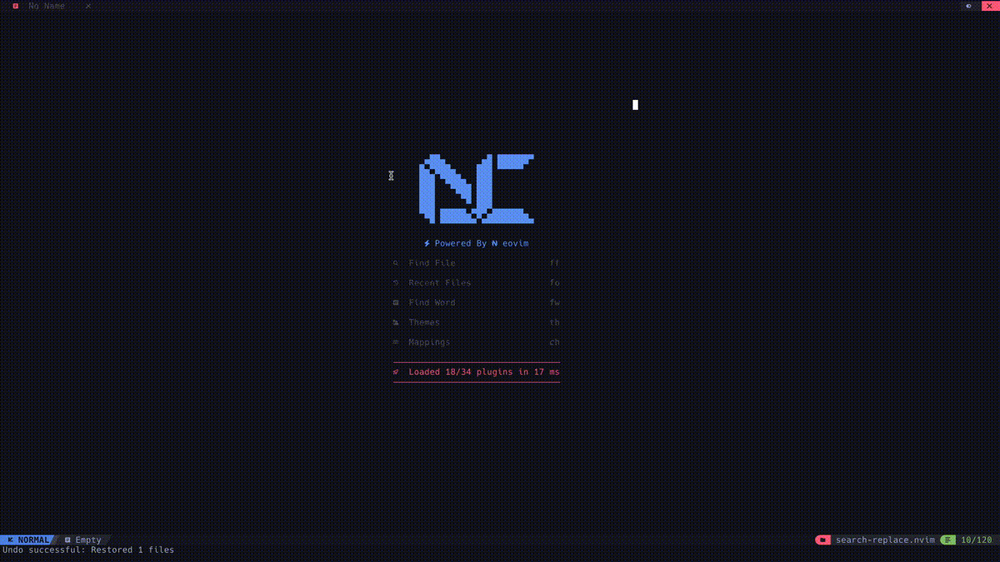

# search-replace.nvim

A powerful search and replace plugin for Neovim using [ripgrep](https://github.com/BurntSushi/ripgrep).

<p align="center">
  
</p>

<p align="center">
  <em>Fast project-wide search and replace with live preview and undo support</em>
</p>

## ✨ Features

- 🔍 **Fast Search** - Powered by ripgrep for blazing fast project-wide search
- 👁️ **Live Preview** - See changes before applying them
- 🔎 **Browse Mode** - Navigate through matches with `n`/`N` before replacing (NEW in v0.2.0)
- 📁 **File Grouping** - Results grouped by file for easy navigation
- ✅ **Selective Replace** - Choose which files to include/exclude
- 🎯 **Glob Filtering** - Filter by file patterns (e.g., `*.lua`, `src/`, `!tests/`)
- ⌨️ **Keyboard Driven** - Full keyboard navigation with Tab/Shift-Tab
- ↩️ **Undo Support** - Revert replacements with a single keystroke

## 📦 Requirements

- Neovim >= 0.8
- [ripgrep](https://github.com/BurntSushi/ripgrep)
- [nui.nvim](https://github.com/MunifTanjim/nui.nvim)
- [plenary.nvim](https://github.com/nvim-lua/plenary.nvim)

## 🚀 Installation

### [lazy.nvim](https://github.com/folke/lazy.nvim)

**Option 1: Load on startup (simpler)**

```lua
{
  "Jason-Bai/search-replace.nvim",
  dependencies = {
    "MunifTanjim/nui.nvim",
    "nvim-lua/plenary.nvim",
  },
  lazy = false,  -- Load on startup to register keymaps
  config = function()
    require("search-replace").setup()
  end,
}
```

**Option 2: Lazy load on keymap (recommended)**

```lua
{
  "Jason-Bai/search-replace.nvim",
  dependencies = {
    "MunifTanjim/nui.nvim",
    "nvim-lua/plenary.nvim",
  },
  keys = {
    { "<leader>sr", "<cmd>lua require('search-replace').open()<cr>", desc = "Search and Replace" },
  },
  config = function()
    require("search-replace").setup({
      keymap = false,  -- Don't set default keymap, using lazy.nvim keys instead
    })
  end,
}
```

### [packer.nvim](https://github.com/wbthomason/packer.nvim)

```lua
use {
  "Jason-Bai/search-replace.nvim",
  requires = {
    "MunifTanjim/nui.nvim",
    "nvim-lua/plenary.nvim",
  },
  config = function()
    require("search-replace").setup()
  end,
}
```

## ⚙️ Configuration

```lua
require("search-replace").setup({
  -- Keymap to open search-replace dialog
  -- Set to false to disable default keymap
  keymap = "<leader>sr",

  -- Window options
  win_options = {
    width = 0.8,   -- 80% of editor width
    height = 0.8,  -- 80% of editor height
  },

  -- Additional ripgrep options
  rg_options = {
    -- "--hidden",      -- Search hidden files
    -- "--no-ignore",   -- Don't respect .gitignore
  },
})
```

## ⌨️ Keybindings

### Global

| Key          | Description                |
| ------------ | -------------------------- |
| `<leader>sr` | Open search-replace dialog |

### In Dialog

| Key         | Description                                               |
| ----------- | --------------------------------------------------------- |
| `Tab`       | Next field (Search → Replace → Flags → Results → Preview) |
| `Shift-Tab` | Previous field                                            |
| `Enter`     | Execute search (in Search/Flags field)                    |
| `Esc` / `q` | Close dialog                                              |

### In Results

| Key       | Description                           |
| --------- | ------------------------------------- |
| `j` / `k` | Navigate results                      |
| `Space`   | Toggle file selection                 |
| `o`       | Open Browse Mode (navigate matches)   |
| `r`       | Execute replacement on selected files |
| `u`       | Undo last replacement                 |

### In Browse Mode (NEW in v0.2.0)

| Key   | Description                |
| ----- | -------------------------- |
| `n`   | Jump to next match         |
| `N`   | Jump to previous match     |
| `q`   | Exit Browse Mode           |
| `Tab` | Return to normal navigation |

## 📖 Usage

### Basic Workflow

1. Press `<leader>sr` to open the search-replace dialog
2. Enter your search pattern in the **Search** field
3. (Optional) Enter replacement text in the **Replace** field
4. (Optional) Add file filters in the **Flags/Filter** field:
   - `*.lua` - Only Lua files
   - `src/` - Only files in src directory
   - `!tests/` - Exclude tests directory
5. Press `Enter` to search
6. Use `Space` to select/deselect files
7. Press `r` to apply replacements
8. Press `u` to undo the last replacement if needed

### Browse Mode (v0.2.0+)

Before replacing, you can inspect each match in detail:

1. After searching, navigate to any file in **Results**
2. Press `o` to enter **Browse Mode**
3. Use `n` / `N` to jump between matches in the file
4. The title bar shows your position: `Browse [3/8] - filename:42`
5. Press `q` to exit Browse Mode and return to Results
6. Select files with `Space` and press `r` to replace

**Why use Browse Mode?**
- 👀 Review matches in their full context before replacing
- 🎯 Quickly navigate through all occurrences with `n`/`N`
- ✅ Make informed decisions about which files to replace

## 🔧 Health Check

Run `:checkhealth search-replace` to verify your setup.

## 📄 License

MIT

## 🙏 Credits

- [ripgrep](https://github.com/BurntSushi/ripgrep) - Fast search tool
- [nui.nvim](https://github.com/MunifTanjim/nui.nvim) - UI components
- [plenary.nvim](https://github.com/nvim-lua/plenary.nvim) - Lua utilities
